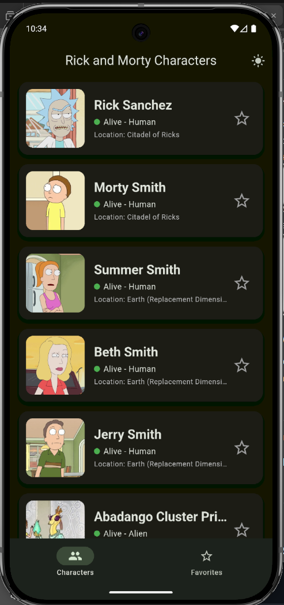
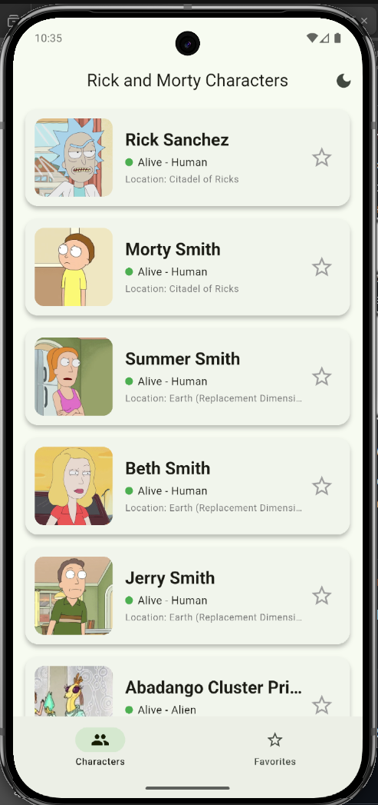
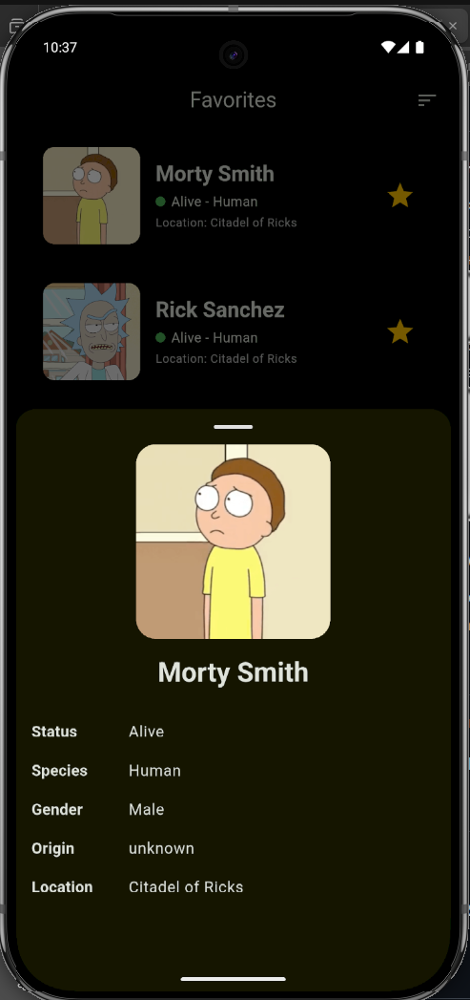
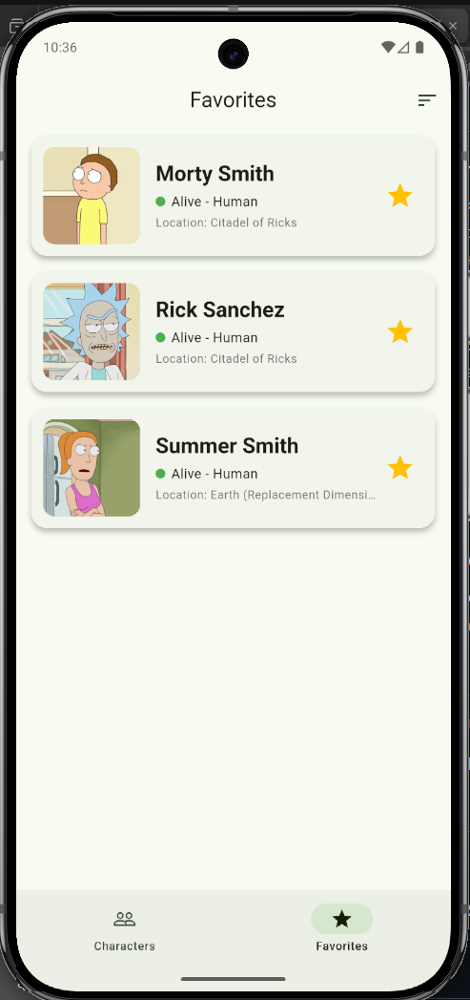

# rick_and_morti_characters

Мобильное приложение на Flutter для просмотра персонажей мультсериала "Рик и Морти" с использованием публичного API.

## Возможности

- 📱 Список всех персонажей с пагинацией
- ⭐ Добавление персонажей в избранное
- 🔄 Оффлайн-режим с кешированием данных
- 🌓 Темная и светлая темы
- 🎨 Анимации при добавлении/удалении избранных
- 📊 Сортировка избранных персонажей

## Технологический стек

- **State Management**: Provider (ChangeNotifier)
- **HTTP-клиент**: http
- **Локальная БД**: sqflite
- **Кеширование изображений**: cached_network_image
- **Навигация**: BottomNavigationBar

## Требования

- Flutter SDK: >= 3.0.0
- Dart: >= 3.0.0

## Зависимости

```yaml
dependencies:
  flutter:
    sdk: flutter
  provider: ^6.1.5+1
  http: ^1.1.2
  sqflite: ^2.4.2
  path: ^1.8.3
  cached_network_image: ^3.4.1
  shared_preferences: ^2.5.3
```

## Установка и запуск

1. Клонируйте репозиторий:

```bash
git clone https://github.com/ByteHunter833/Rick_and_Morti_characters.git
cd Rick_and_Morti_characters
```

2. Установите зависимости:

```bash
flutter pub get
```

3. Запустите приложение:

```bash
flutter run
```

## Структура проекта

```
lib/
├── main.dart                 # Точка входа
├── models/                   # Модели данных
│   └── character.dart
├── services/                 # Сервисы
│   ├── api_service.dart     # Работа с API
│   └── database_service.dart # Работа с БД
├── providers/               # State management
│   └── character_provider.dart
|   themes/                   # Theme
|   └──light_mode.dart
    └──dark_mode.dart
├── screens/                 # Экраны
│   ├── characters_screen.dart
│   └── favorites_screen.dart
└── widgets/                 # Виджеты
    └── character_card.dart
```

## Особенности реализации

### Кеширование

- Все загруженные персонажи сохраняются в SQLite
- При отсутствии интернета данные загружаются из локальной БД
- Изображения кешируются автоматически через cached_network_image

### Избранное

- Список избранных хранится в SQLite
- Синхронизация между экранами через Provider
- Анимированное добавление/удаление

### Пагинация

- Автоматическая подгрузка при достижении конца списка
- Индикатор загрузки внизу списка

### Темная тема

- Переключение через иконку в AppBar
- Настройка сохраняется в SharedPreferences

## Screenshots

## Screenshots

| Dark Mode                                                             | Light Mode                                                             |
| --------------------------------------------------------------------- | ---------------------------------------------------------------------- |
|   |  |
|  |        |

## API

Приложение использует [Rick and Morty API](https://rickandmortyapi.com/documentation/)

Основной endpoint: `https://rickandmortyapi.com/api/character`

## Автор

ByteHunter833

## Лицензия

MIT License
